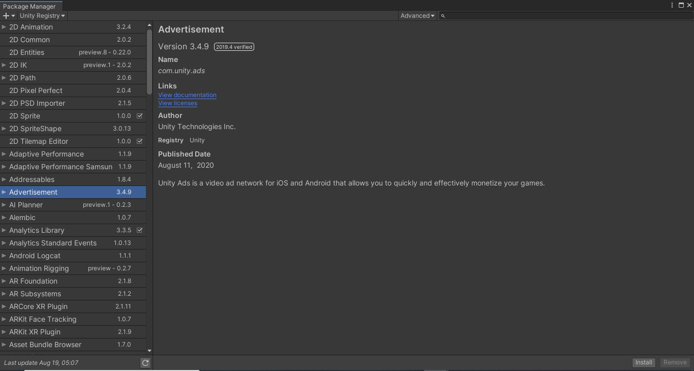
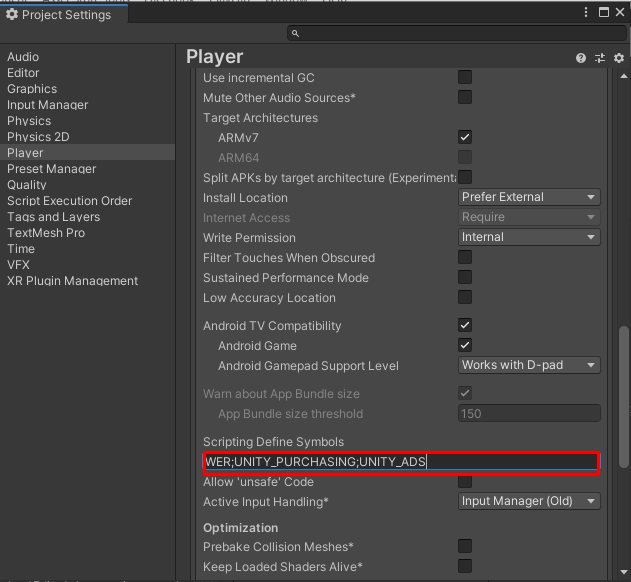

# Getting Started with the Demo

Before download and import it to your project you should setup project to support **Unity Ads** and **Unity Purchasing** to avoid an errors

## Enable Unity Ads

* You can open `Services` tab from menu **Windows -> General -> Services**

* Then select ADS

* And turn on, turn on **Enable built-in Ads extension**. and import the **Advertisement** package from package manager (Menu: Windows -> Package Manager)

## Enable Unity Purchasing

* You can open `Services` tab from menu **Windows -> General -> Services**

* Then select In-App Purchasing

* And turn on, then import the Purchasing package

## Add UNITY_PURCHASING and UNITY_ADS to scripting define symbols

* Open project settings by menu: Edit -> Project Settings

* Go to `Player` section

* Find `Scripting Define Symbols` field in `Other Settings` section

* Put `UNITY_PURCHASING` if you're going to try IAP and `UNITY_ADS` if you're going to try ADS

* Separating each symbol by `;`. so you will append `UNITY_PURCHASING;UNITY_ADS` to `Scripting Define Symbols` field

## PUN2 version

If you use PUN2 version, you have to setup PUN2 by import [PUN2 Package](https://assetstore.unity.com/packages/tools/network/photon-unity-networking-classic-free-1786?aid=1100lGeN)

Then create your project via [Photon's Dashboard](https://www.photonengine.com/en-us/Photon) and [setup AppId](https://doc.photonengine.com/en-us/pun/current/getting-started/initial-setup)

## Import the package

After import packages done, then we’re going to test the Demo, click menu **File -> Build Settings**

Then drag **Home** and **Battle** scenes from **ShooterIO/Demo/Scenes** to add them in **Scenes In Build** section

Then you can test the build, Press on **Build** button

Then test by create game

And join game by another instance

