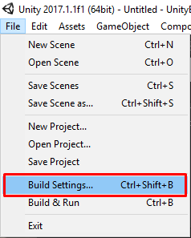

* * *

This is the guide for Shooter IO game template which selling at Unity Asset Store ([https://www.assetstore.unity3d.com/#!/content/104584?aid=1100lGeN](https://www.assetstore.unity3d.com/#!/content/104584?aid=1100lGeN))

Before download and import it to your project you should setup project to support **Unity Ads** and **Unity Purchasing** to avoid an errors

You can enable **Unity Ads** as following steps via link [https://unity3d.com/services/ads/quick-start-guide](https://unity3d.com/services/ads/quick-start-guide)

If you enabled **Unity Ads** but an errors still occurs, you can try import **Unity Ads** package from **Unity Asset Store**([https://www.assetstore.unity3d.com/en/#!/content/66123?aid=1100lGeN](https://www.assetstore.unity3d.com/en/#!/content/66123?aid=1100lGeN))

And also enable **Unity Purchasing** as following steps via link [https://docs.unity3d.com/Manual/UnityIAPSettingUp.html](https://docs.unity3d.com/Manual/UnityIAPSettingUp.html)

If you enabled **Unity Purchasing** but an errors still occurs after imports Battle IO package you might have to import these two packages

Import these packages

When all packages already imported, it will be contains things like this

After import packages done, then we’re going to test the Demo, click menu **File -> Build Settings**

Then drag **Home** and **Battle** scenes from **ShooterIO/Demo/Scenes** to add them in **Scenes In Build** section

Then you can test the build, Press on **Build** button

Then test by create game

And join game by another instance

