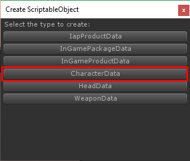

* * *

This is the guide for Shooter IO game template which selling at Unity Asset Store ([https://www.assetstore.unity3d.com/#!/content/104584?aid=1100lGeN](https://www.assetstore.unity3d.com/#!/content/104584?aid=1100lGeN))

Things you have to do to add new character for this template are:

*   Prepare **Character Model**
*   Create and set **Character Data**
*   Add created **Character Data** to **Game Instance**

Okay, Let’s start

First, prepare character model. You may create empty scene then drag your character model into the scene to manage it, In your character model add **CharacterModel** component

Then explore into character model children drag game object which you want to instantiate model to each container in **CharacterModel** component

Then make it as a prefab.

Next, you have to create **CharacterData**, right click on anywhere in Project tab choose **Create -> ScriptableObject**

In **Create ScriptableObject** dialog choose **CharacterData**

Then set it name as you wish but it must be unique for example I set it as **Character001**

Then in character data set **Character Model** to character model prefab that you have created

Then open **Home** scene add character data to **GameInstance**

With Fantasy Customizable Pack, you can create new character easily try it!!

[**Fantasy Customizable Pack by SURIYUN**  
_Fantasy Customizable Pack Create many unique characters with over 950+ hand-painted pieces. Custom user interface for…_www.assetstore.unity3d.com](https://www.assetstore.unity3d.com/en/#!/content/68910?aid=1100lGeN "https://www.assetstore.unity3d.com/en/#!/content/68910?aid=1100lGeN")