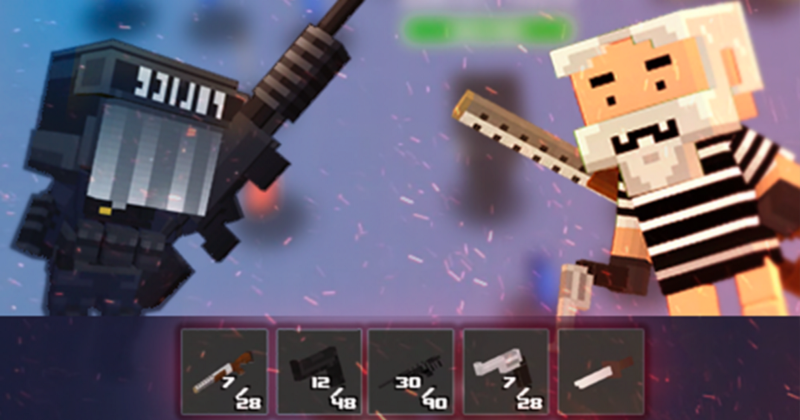

* * *

This is the guide for Shooter IO game template which selling at Unity Asset Store ([https://www.assetstore.unity3d.com/#!/content/104584?aid=1100lGeN](https://www.assetstore.unity3d.com/#!/content/104584?aid=1100lGeN))

An character attributes, it will be random to let player to choose which attributes they want to add when level up

So you have to create character attributes data

How to do?, right click on anywhere in Project tab choose **Create -> ScriptableObject**

In **Create ScriptableObject** dialog choose **Character Attributes**

Then set its data

Then at them at **Battle** scene **GameManager** there is **Available Abilities**

