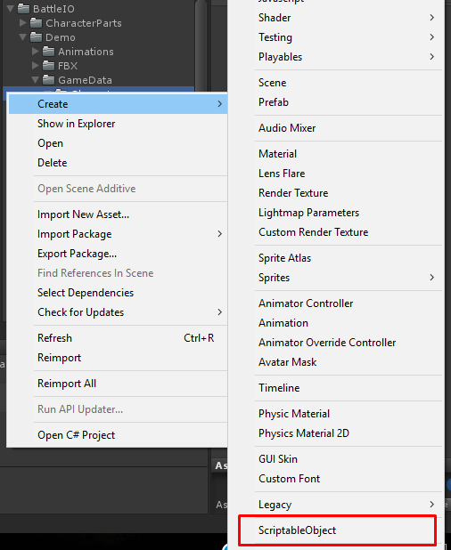

* * *

This is the guide for Shooter IO game template which selling at Unity Asset Store ([https://www.assetstore.unity3d.com/#!/content/104584?aid=1100lGeN](https://www.assetstore.unity3d.com/#!/content/104584?aid=1100lGeN))

Things you have to do to add new helmet item for this template are:

*   Prepare **Helmet Model**
*   Create and set **Head Data**
*   Add created **Head Data** to **Game Instance**

Okay, Let’s start

First, prepare helmet model. You may create empty scene then drag your helmet model into the scene to manage it, Then make it as prefab

Next, you have to create **HeadData**, right click on anywhere in Project tab choose **Create -> ScriptableObject**

In **Create ScriptableObject** dialog choose **HeadData**

Then in head data set **Model Object** to helmet model prefab that you have created

Then open **Home** scene add head data to **GameInstance**

Then open **Home** scene add head data to **GameInstance**

