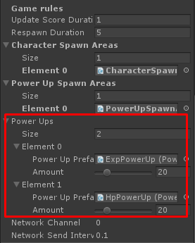

* * *

This is the guide for Shooter IO game template which selling at Unity Asset Store ([https://www.assetstore.unity3d.com/#!/content/104584?aid=1100lGeN](https://www.assetstore.unity3d.com/#!/content/104584?aid=1100lGeN))

Things you have to do to add new power up for this template are:

*   Prepare **Power up** model / effects
*   Add **Power Up Entity** component to the model / effects and set its data
*   Add created **Power Up Entity** to **Gameplay Manager**

First, prepare the power up model / effects then add **Power Up Entity** component to that game object, set amount of **Hp**, **Exp** which character will receives when colliding to.

**Power Up Effect** is effect which will be played when character received this power up

Then you have to add any collider to make it able to collided by characters

Then make it as prefab, you will use this prefab to add it in **GameplayManager -> Power Ups**

