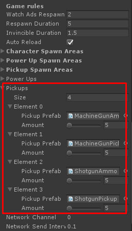

# How to add pickup entity

Things you have to do to add new power up for this template are:

*   Prepare **Pickup** model
*   Add **Pickup Entity** component to the model and set its data
*   Add created **Pickup Entity** to **Gameplay Manager**

First, prepare the power up model then add **Pickup Entity** component to that game object, set type of picking up item it can be **Ammo** or **Weapon** then set amount of **Ammo** which character will receives when colliding to.

Then you have to add any collider to make it able to collided by characters

Then make it as prefab, you will use this prefab to add it in **GameplayManager -> Pickups**

