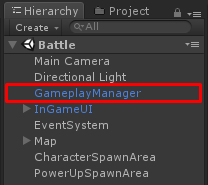

# Gameplay Manager configuration

In **Battle** scene you will see **GameplayManager** game object

You can set gameplay configuration here, There are following configs

*   **Max​ ​Level**​​ ​is​ ​max​ ​level​ ​of​ ​all​ ​characters
*   **Exp**​ ​​is​ ​min​ ​exp​ ​to​ ​max​ ​exp​ ​to​ ​level​ ​up​ ​characters​ ​with​ ​its growth​ ​potential
*   **Reward​ ​Exp​​** ​is​ ​min​ ​and​ ​max​ ​exp​ ​that​ ​will​ ​be​ ​received​ ​when killed​ ​enemy​ ​character
*   **Reward Currencies** is the list of currencies player will receive when killed enemy character
*   **Kill​ ​Score**​​ ​is​ ​min​ ​and​ ​max​ ​score​ ​that​ ​will​ ​be​ ​received when​ ​killed​ ​enemy​ ​character
*   **Base​ ​Max​ ​Hp**​​ ​is​ ​base​ ​max​ ​Hp​ ​for​ ​all​ ​characters
*   **Base​ ​Max​ ​Armor**​​ ​is​ ​base​ ​max​ ​armor​ ​for​ ​all​ ​characters
*   **Base​ ​Move​ ​Speed**​​ ​is​ ​base​ ​move​ ​speed​ ​for​ ​all​ ​characters
*   **Base​ ​Weapon​ ​Damage​ ​Rate**​​ ​is​ ​base​ ​rate​ ​of​ ​bullet​ ​damage for​ ​all​ ​characters
*   **Base​ ​Armor​ ​Reduce​ ​Damage​ ​Rate**​​ ​is​ ​base​ ​rate​ ​to​ ​reduce bullet​ ​damage​ ​when​ ​armor​ ​>​ ​0​ ​for​ ​all​ ​characters
*   **Adding​ ​Stat​ ​Point**​​ ​is​s​Stat​ ​point​ ​which​ ​will​ ​increase when​ ​level​ ​up​ ​this​ ​is​ ​required​ ​to​ ​add​ ​an​ ​stats
*   **Min​ ​Attack​ ​Vary​ ​Rate**​,​ ​​**Max​ ​Attack​ ​Vary​ ​Rate** ​​are Rate that will be random by min and max value to multiply with attack
*   **Available Attributes** an character attributes, it will be random to let players choose which attributes they want to add when level up
*   **Respawn​ ​Duration​​** ​duration​ ​to​ ​let​ ​players​ ​respawn​ ​after death
*   **Invincible Duration** duration for every character to be invincible after respawned
*   **Character​ ​Spawn​ ​Areas​​** ​is​ ​the list of​ ​​**SpawnArea**​ ​​that​ ​will​ ​be​ ​used to​ ​spawn​ ​characters​
*   **Power​ ​Up​ ​Spawn​ ​Areas**​​ ​is​ ​the list of​ **​​SpawnArea**​ ​​that​ ​will​ ​be​ ​used​ ​to spawn​ ​power​ ​up items
*   **Pick​up​ ​Spawn​ ​Areas**​​ ​is​ ​the list of​ **SpawnArea**​ ​​that​ ​will​ ​be​ ​used​ ​to spawn​ dropped weapons/ammos
*   **Power​ ​Ups**​​ ​is​ the list of ​ **​​Power​ ​Up​ ​Entity​** ​​prefab​ ​with​ ​amount​ ​to spawn
*   **Pickups** is the list of **Pickup Entity** prefab with amount to spawn