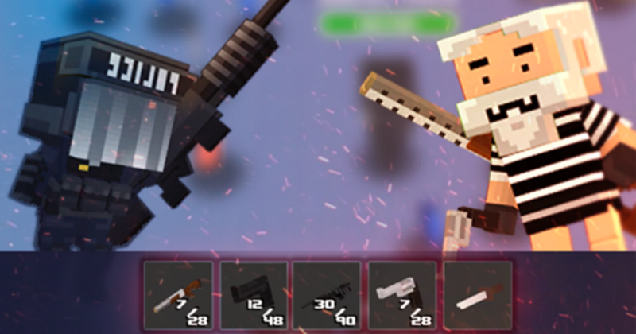
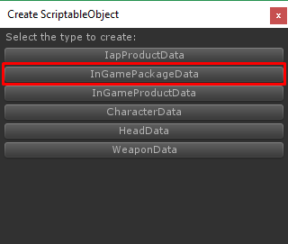
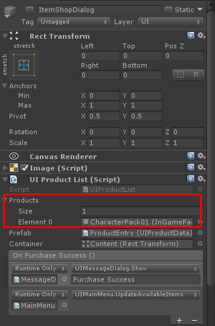
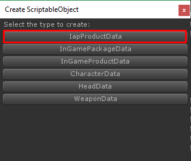
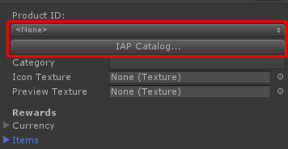
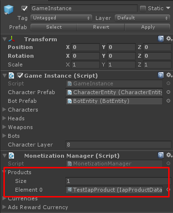

* * *

This is the guide for Shooter IO game template which selling at Unity Asset Store ([https://www.assetstore.unity3d.com/#!/content/104584?aid=1100lGeN](https://www.assetstore.unity3d.com/#!/content/104584?aid=1100lGeN))

In Home scene you will see **GameInstance** game object, in the **Monetization Manager** component you can set following configuration:

*   **Products** an IAP product data list
*   **Currencies** virtual currencies list
*   **Ads Reward Currency** amount of currency that can be received after watches ads

### How to add In Game Package Data

**InGamePackageData** is data for package that can be purchased with virtual currency, To create it you have to do following steps:

*   Right click on anywhere in Project tab choose **Create -> ScriptableObject**

*   In **Create ScriptableObject** dialog choose **InGamePackageData**

*   Set its name as you wish but it must be unique for example I set it as **CharacterPack01**

An configuration for **InGamePackageData** contains

*   **Icon Texture** texture that being used in UI as icon image
*   **Preview Texture** texture that being used in UI as preview image
*   **Title** package’s title
*   **Description** package’s description
*   **Price** package’s price, the price this virtual currency its **Id** must be existed in **Monetization Manager** settings
*   **Can Buy Only** **Once** if this is **True** player will able to buy this item once
*   **Items** an In-game items that being received when player purchased this product, An Head Data, Character Data and Weapon Data are item too

After create **InGamePackageData** then you have to add to any **UI Product List** component for example you can add it in **ItemShopDialog** or **GoldShopDialog** to make it showing in that dialog

### How to add Iap Product Data

**IapProductData** is data for product that can be purchased with real money, To create it you have to do following steps:

*   Right click on anywhere in Project tab choose **Create -> ScriptableObject**

*   In **Create ScriptableObject** dialog choose **IapProductData**

*   Set its name as you wish but it must be unique for example I set it as **TestIapProduct**
*   Then set Product Id of any IAP Catalog which you can manage it via IAP Catalog, you can click **IAP Catalog…** button to manage it. About IAP Catalog, you can read it at: [https://docs.unity3d.com/Manual/UnityIAPDefiningProducts.html](https://docs.unity3d.com/Manual/UnityIAPDefiningProducts.html)

An configuration for **IapProductData** contains

*   **Icon Texture** texture that being used in UI as icon image
*   **Preview Texture** texture that being used in UI as preview image
*   **Currency** currency that being received when player purchased this product
*   **Items** an In-game items that being received when player purchased this product, An Head Data, Character Data and Weapon Data are item too

After create **IapProductData** you have to add it in **MonetizationManager** it’s located at **Home** scene, **GameInstance** game object

And then add to any **UI Product List** component for example you can add it in **ItemShopDialog** or **GoldShopDialog** to make it showing in that dialog

