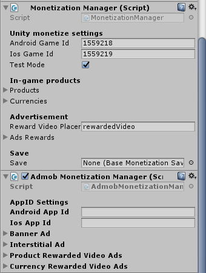
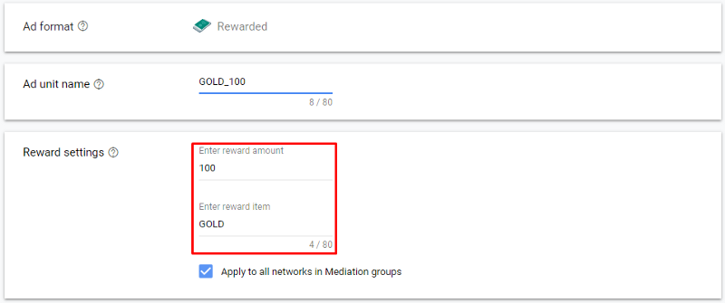
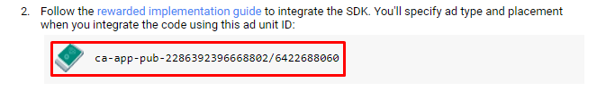
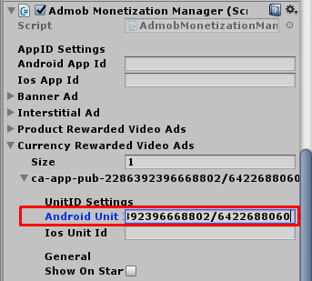
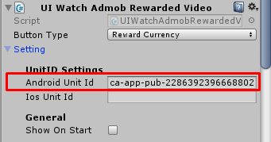

* * *

I have made Admob integration (can download it here [https://github.com/insthync/unity-simple-monetization-admob/releases](https://github.com/insthync/unity-simple-monetization-admob/releases))

After import, add AdmobMonetizationManager at the same game object which added MonetizationManager then set an App Id (can get it from Admob

Then you can set settings for an Ad unit that you are going to use, for rewarded video it can set Reward and its Amount, You can set reward as currency id such as GOLD, GEM or set it as product id such as Sword / Shield

Then copy ad unit to setting

You also can replace UIWatchAdsButton to UIWatchAdmobRewardedVideoAdsButton

