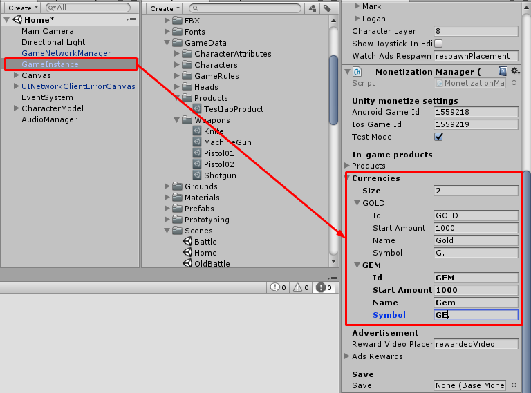
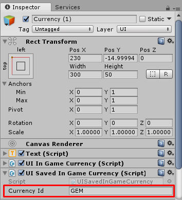
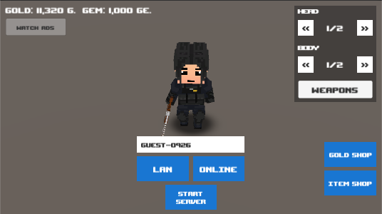
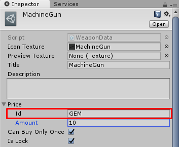
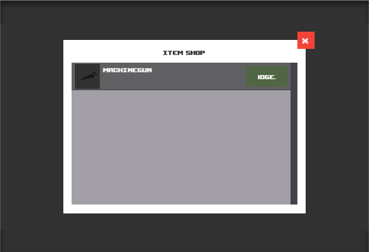

# How to add new currency

You can add new currency in **Home** scene, there are **GameInstance** select it then find component named **Monetization Manager** at Inspector you can add currency at **Currencies** list, for this example I will add **GEM**

* * *

To show amount of this currency you can add **Text** component with **UI Saved In Game Currency** component with **Currency Id** as you added in **Currencies** list

* * *

To set product price with your currency, just set currency Id at Price -> Id data in your product data

