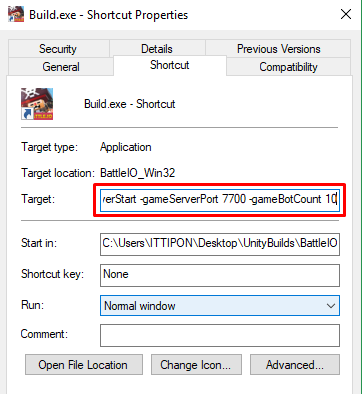
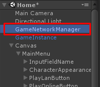
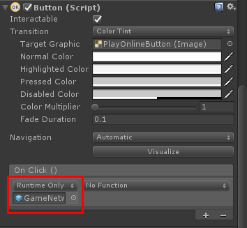
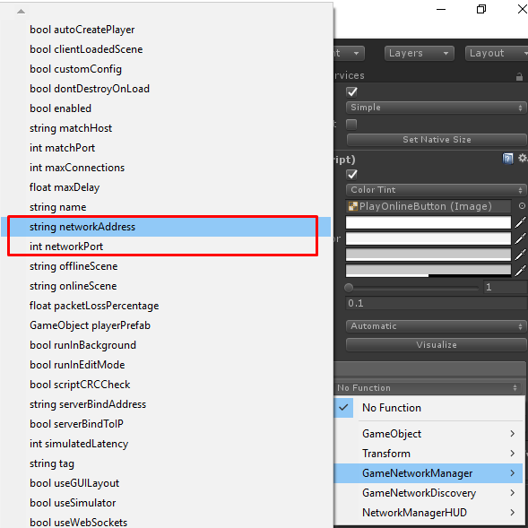
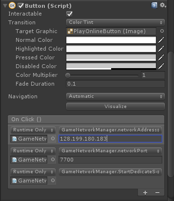

* * *

This is the guide for game template which selling at Unity Asset Store there are

*   Battle IO ([https://www.assetstore.unity3d.com/#!/content/101113?aid=1100lGeN](https://www.assetstore.unity3d.com/#!/content/101113?aid=1100lGeN))
*   Bomber IO ([https://www.assetstore.unity3d.com/#!/content/102515?aid=1100lGeN](https://www.assetstore.unity3d.com/#!/content/102515?aid=1100lGeN))
*   Shooter IO ([https://www.assetstore.unity3d.com/en/#!/content/104584?aid=1100lGeN](https://www.assetstore.unity3d.com/en/#!/content/104584?aid=1100lGeN))

Command Line Arguments list for dedication there are:

*   \-gameServerStart : Start dedicate server
*   \-gameServerPort : Change server port
*   \-gameMaxConnections : Max server connections
*   \-gameRule : Name of game rule, for the demo there are IONetworkGameRule, DeathMatchNetworkGameRule
*   \-gameBotCount : Amount of bots

Example of command line usage (For Linux/Mac)

> ./Build.x86\_64 -gameServerStart -gameServerPort 7700 -gameMaxConnections 50 -gameRule IONetworkGameRule -gameBotCount 10

For Windows you can set arguments in shortcut’s properties

So by this example, server configurations will be set as:

*   Server Port = 7700
*   Max Connections = 50
*   Game Rule = IONetworkGameRule
*   Bot Count = 10

* * *

### How to make connection to server button example

Select the button you want to use it to connect to your server , for this example I will use PlayOnlineButton

Then add button on click event to set Network Address, Network Port and start server

