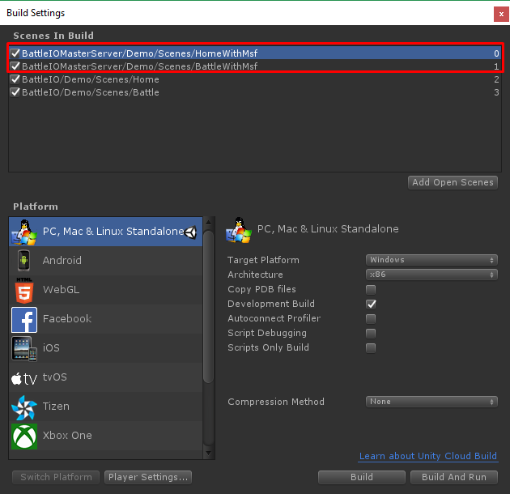
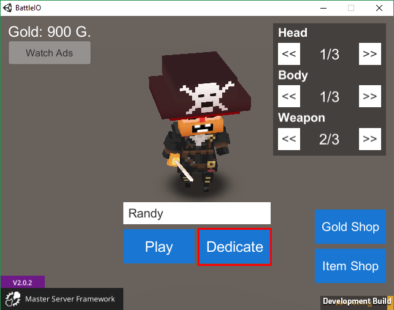
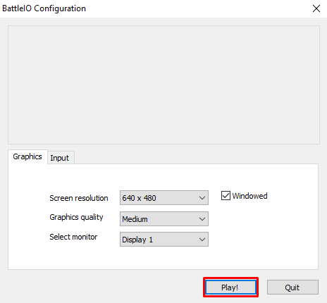
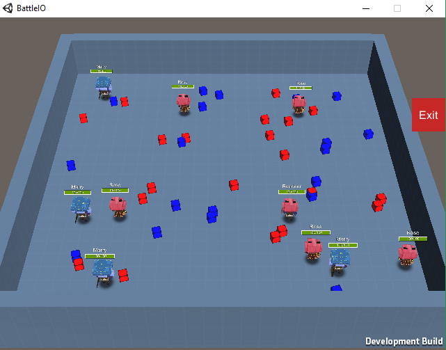
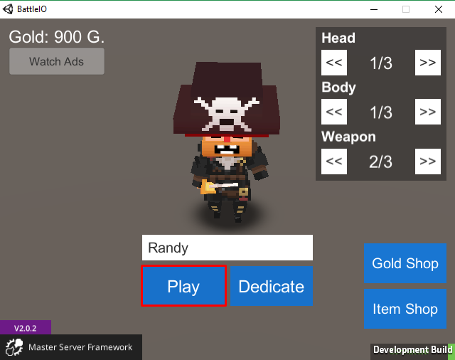
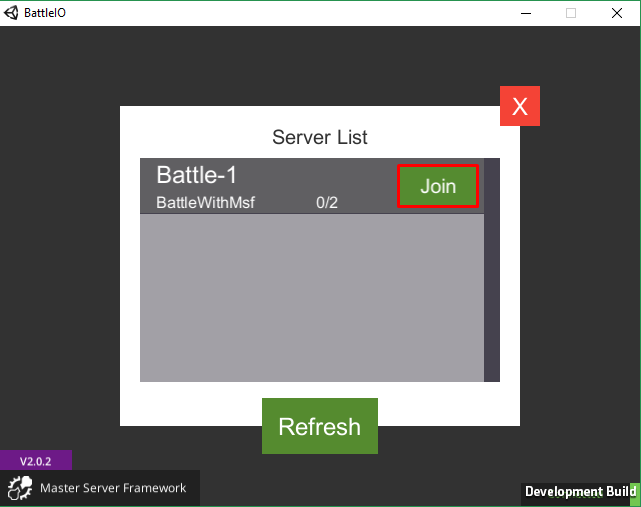
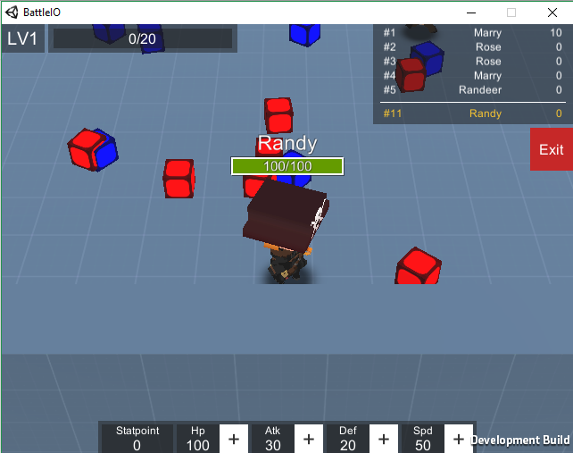
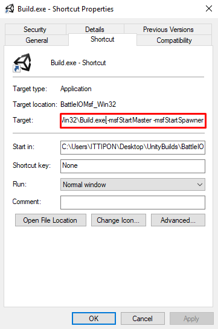

* * *

This is the guide for game template which selling at Unity Asset Store there are

*   Battle IO ([https://www.assetstore.unity3d.com/#!/content/101113?aid=1100lGeN](https://www.assetstore.unity3d.com/#!/content/101113?aid=1100lGeN))
*   Bomber IO ([https://www.assetstore.unity3d.com/#!/content/102515?aid=1100lGeN](https://www.assetstore.unity3d.com/#!/content/102515?aid=1100lGeN))
*   Shooter IO ([https://www.assetstore.unity3d.com/en/#!/content/104584?aid=1100lGeN](https://www.assetstore.unity3d.com/en/#!/content/104584?aid=1100lGeN))

Now I’ve made Master Server integration for Battle IO project its repository is located at   
[https://github.com/insthync/BattleIOMasterServer](https://github.com/insthync/BattleIOMasterServer)  
[https://github.com/insthync/BattleIOMasterServer/releases](https://github.com/insthync/BattleIOMasterServer/releases)

For Bomber IO it is located at  
[https://github.com/insthync/BomberIOMasterServer](https://github.com/insthync/BomberIOMasterServer)  
[https://github.com/insthync/BomberIOMasterServer/releases](https://github.com/insthync/BomberIOMasterServer/releases)

For ShooterIO it is located at  
[https://github.com/insthync/ShooterIOMasterServer](https://github.com/insthync/ShooterIOMasterServer)  
[https://github.com/insthync/ShooterIOMasterServer/releases](https://github.com/insthync/ShooterIOMasterServer/releases)

In this blog, I will write about how to getting started and set an configuration

* * *

### Getting Started

Let’s getting started, after download and import the release package add **HomeWithMsf** and **BattleWithMsf** scenes in scenes in build, they’re located at BattleIOMasterServer/Demo/Scenes

Then build it with name **Build.exe** because I have set build path to **./Build.exe** if you want to use another file name look how to change it at Configurations section below 😝 (Keyword: Default Exe Path), after build open the game then press on **Dedicate** button to dedicate the server

Then the server will be started and spawner server will start another instance as a game room server it will show Unity game configuration that you have to press on **Play!** button to start the game room server, don’t worry for production server there are solutions to not have to press **Play!** button to start the server I will explains about it later

Press on Play! button to start game room server

Game room server started

Then back to the first instance, press **Play** button then select the game room in the list

Press Play button

Join the room

Then another instance for game room will be started because I have set configs to make it start new room server when there are an average players of every rooms equals to 1, Now there are 1 player in 1 room so it will start new room 😛

That is it.

* * *

### Configurations

In the **HomeWithMsf** scene you can set following configs:

*   **HomeSceneMsf/MasterServer** game object  
    \- **Port**: This is the port of master server which will be connected by Game room server and client, so if you want to change this port you have to change port at **HomeSceneMsf/ConnectionToMaster** game object to make it able to connect with master server
*   **HomeSceneMsf/Spawner** game object  
    \- **Default Machine Ip**: This is IP address to connect to game room server, you must set it to remote IP of the machine that running game room server, In cases that you want to make game room servers run separately machines you have to set **Server Ip** in **HomeSceneMsf/ConnectionToMaster** game object to master server remote Ip  
    \- **Default Exe Path**: Path to exe file (game build file), if this path is incorrect spawner server will not able to start game room servers, **NOTE:** Do not put “./” before the executable name! It seems strange, but for some reason, when running on linux, it assumes the entire entry is the path. If you are in the folder “/root/” it will end up looking for “/root/./GameServer.x86\_64”  
    \- **Default Spawn In Batchmode**: if this is True when start game room servers it will be started as Batchmode which is no graphics this is good for production and with Batchmode, Unity game configuration dialog will not being shown  
    \- **Max Spawned Processes**: Max game room servers that can be started in the machine set it to 0 to unlimited  
    \- **Spawn Webgl Servers**: if this is True all game room servers will be started as Webgl server  
    \- **Dont Destroy If Started**: if this is True, and if spawner is started this game object will not be destroyed when switching scenes  
    \- **Kill Processes When Spawner Quits**: if this is True, all game room servers will be quits when spawner server quits  
    \- **Auto Start In Editor**: if this is True spawner server will be started automatically in the editor to run game room servers  
    \- **Override Exe Path In Editor**: if this is True, it will run game room servers by **Exe Path From Editor** when running in the editor
*   **HomeSceneMsf/MasterServer/IOGamesModule** game object  
    \- **Scene**: The gameplay scene  
    \- **Room Name**: The room name prefix, real room name will be add with counting number, so if this is set to Battle- real room name will be Battle-1, Battle-2, Battle-3 and so on  
    \- **Max Players**: Max players for each game rooms  
    \- **Players Amount To Create New Room**: New game room server will be started when average players of every rooms more than this value  
    \- **Count Players To Create New Room Duration**: Duration to count players in every servers to calculate and start new game room server  
    \- **Start Port**: Start port for game room server, real port will be increase when more game room servers stated

* * *

### **Custom Battle Scene**

If you have prepared your battle scene then there are something you have to add to your scene there are

*   **BattleSceneMsf** this is collection of scripts that require to connect to master server, you can find the prefab in Project tab
*   **GameplayManager** for the Demo you can find the prefab in Project tab
*   **GameNetworkManagerWithMsf** for the Demo you can find the prefab in Project tab
*   **InGameUI** for the Demo you can find the prefab in Project tab
*   **Event System** you can create it from menu GameObject -> UI -> Event System

* * *

### **Running In Production**

To running the server in production I recommend to set **Default Spawn In Batchmode** to True, and if you running server on **Windows** you can set arguments in shortcut like this

For **MAC**/**Linux** you can set arguments when running server by command like this  
$ ./Build.x86\_64 -msfStartMaster -msfStartSpawner

You can see arguments list at

*   [https://github.com/alvyxaz/barebones-masterserver/wiki/Command-Line-Arguments](https://github.com/alvyxaz/barebones-masterserver/wiki/Command-Line-Arguments)
*   [https://docs.unity3d.com/Manual/CommandLineArguments.html](https://docs.unity3d.com/Manual/CommandLineArguments.html)

* * *

### Client

For the client build, you have to set **Server Ip** and **Server Port** via **HomeSceneMsf/ConnectionToMaster** to where you host the master server

You can remove dedicate button, it’s not necessary 😛

* * *

### Conclusion

For the server you have to set

*   **HomeSceneMsf/MasterServer**  
     — Port: listening port to let spawner server, clients connecting to
*   **HomeSceneMsf/MasterServer/IOGamesModule  
    ** —Max Players  
     — Players Amount To Create New Room  
     — Start Port
*   **HomeSceneMsf/Spawner  
    ** — Default Machine Ip (This must be the IP of machine that running game servers)  
     — Default Exe Path

In case that you want to run spawner server on another machine you have to set

*   **HomeSceneMsf/ConnectionToMaster  
    ** — Server Ip: IP of machine that running master server  
     — Server Port: Port of master server
*   **For Mac/Linux launch server with**  
    $ ./Build.x86\_64 -msfStartMaster -msfStartSpawner

Client,

*   **HomeSceneMsf/ConnectionToMaster  
    **— Server Ip: IP of machine that running master server  
    — Server Port: Port of master server

You can remove Dedicate button on client, it’s not necessary

If cannot connect to server, you should check logs from server machine at /root/.config/unity3d/{Company}/{Project Name}