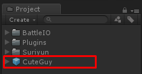

# How to create character with Fantasy Customizable Pack

This is the guide for [Fantasy Customizable Pack](https://assetstore.unity.com/packages/slug/68910?aid=1100lGeN) which selling at Unity Asset Store

*   Open **Customize** scene and press play

*   Customize your character

*   Then set name and save it as prefab

*   Then add set CharacterAnimator to Animator component

*   Then add Character Model component, set equipment containers

*   Then set Character Model in Character Data

*   Done, Try it

