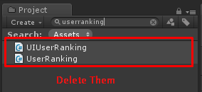

* * *

Hello, after updates of new BattleIO (1.38), BomberIO (1.1) and ShooterIO (1.05) you might found an errors like

NullReferenceException: Object reference not set to an instance of an object UIGameplay.UpdateRankings (.NetworkGameScore\[\] rankings) (at Assets/BattleIO/Scripts/UI/UIGameplay.cs:148)

How to fix it, you have to find “UserRanking” in Project tab then delete them

Then import the package again

That is it, Sorry for an inconvenience, next time I will beware about script file renaming 🙏