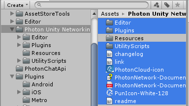
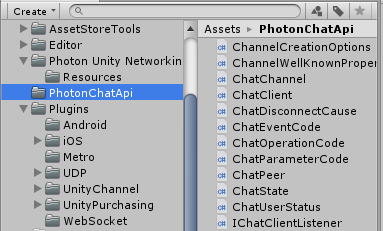
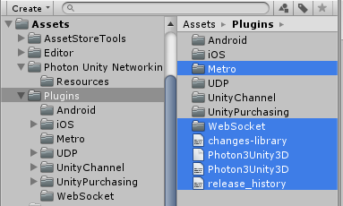

* * *

Before you update, you should backup AppId (You still can see it in dashbord).
Then you have to...

- Remove following files and folders from `Assets/Photon Unity Networking`

- Remove following `PhotonChatApi` folder from `Assets/`

- Remove following files and folders from `Assets/Plugins`

- Remove `SimplePhotonNetworkManager` from `Assets/ShooterIO`

Then import PUN2 package, you can find it in asset store

Then update to latest version of this package